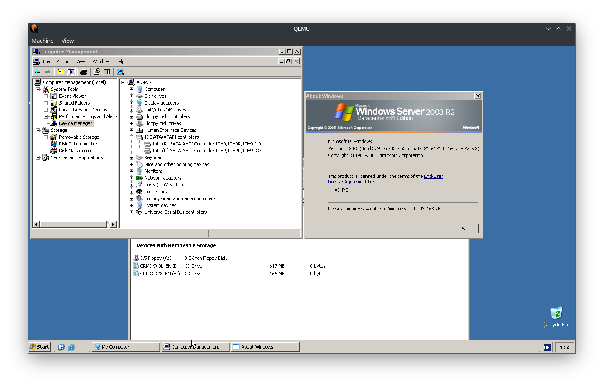
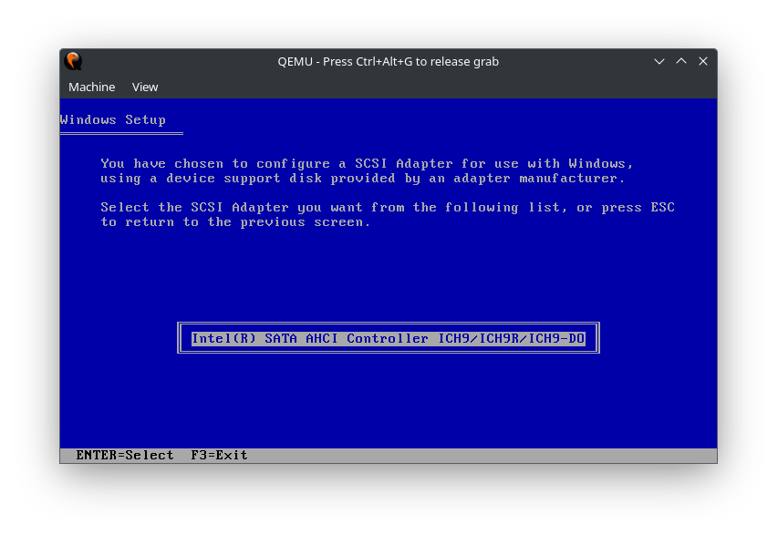

# Bringing the P into the X
## definition, Windows XP virtualiZation, adapting the core image with up-to-date use-case-scenarioZ

#### setting up the Virtual Machine, ~ QEMU, linux > arch-distro

qemu-system-x86_64 \\
-M pc-q35-2.9 -cpu max -smp sockets=1,cores=1,threads=2 -m 4096 -enable-kvm \
-boot menu=on \
-drive file=floppyX64modAHCI.img,if=floppy,index=0,format=raw \
-drive file=en_win_srv_2003_r2_datacenter_x64_with_sp2_vl_cd1_x13-47474.iso,index=1,media=cdrom \
-drive file=en_win_srv_2003_r2_datacenter_x64_with_sp2_vl_cd2_x13-49386.iso,index=2,media=cdrom \
-device ahci,id=ahci \
-drive id=boot,file=winXPserverAHCI.qcow2,index=3,media=disk,format=qcow2,if=none -device ide-hd,drive=boot,bus=ahci.0 \
-drive id=UsbDisk,file=usbStorageEmu.img,index=4,media=disk,format=raw,if=none -device ide-hd,drive=UsbDisk,bus=ahci.1 \
-vga qxl -display gtk \
-usb -device usb-tablet

#### Example of a running client

#### Example of the installation with the modded drivers

 

